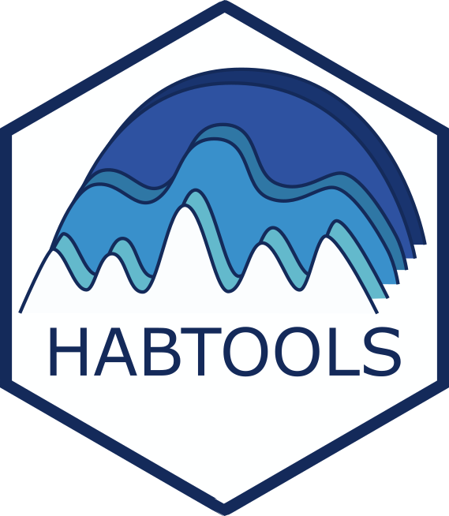

# The *habtools* & biodiversity workshop 

This workshop is a one-day introduction to creating 3D models of natural surfaces and analyzing these using the *[habtools](https://jmadinlab.github.io/habtools/)* R package. The workshop will also provide guidance on how to annotate surfaces with plants, animals and other kinds of data. The workshop has three parts:

1. Capturing a 3D surface 
2. Estimating complexity metrics
3. Exploring biodiversity relationships

An introduction to the workshop can be found [here](https://docs.google.com/presentation/d/144kZaggJfIWfz6h4kGZpERBm7UxttPFXvin1WmoqDBE/edit?usp=sharing). During the workshop we will run through the steps found [here](habtools-workshop.md). 

# Preparation

You will need a laptop with wireless connectivity. You will need space on your hard drive; at least 2GB (approximately "one movie"-worth of space). If you already use any of the software listed below, please update it before the course so that we are all using the same versions.

### Metashape

- Download and install the free 30-day trial version of [Metashape Professional Educational Edition](https://www.agisoftmetashape.com/product/agisoft-metashape-professional-educational-edition/).

### R and RStudio

- Install R first: https://cran.r-project.org.
- After R is installed, install RStudio: https://www.rstudio.com/products/rstudio/download. 
- Open RStudio and install the following packages (menu `Tools` > `Install packages...`): 
   - `ggplot2` 
   - `sf`
   - `dplyr`  
   - `raster`  
   - `habtools`  
   - `rgl` (optional, as it might take some setting-up on some computers)

> You do not need to be good at R coding for this workshop.  However, if you are new to R and Rstudio, and would like to familiarize yourself with the basics, here are some beginner introduction options (https://rladiessydney.org/courses/01-basicbasics-0,  https://r4ds.hadley.nz/intro).  

### GIS software

If you would like to annotate the orthomosaic you create, as might be done in a biodiversity analysis, you can use either ArcGIS or [QGIS](https://qgis.org/download/), the latter of which is a free download. 

### Meshlab

If you're interested in exporting and visualizing a 3D mesh, download [Meshlab](https://www.meshlab.net/#download). It's free. 3D meshes are useful for 3D printing. 
