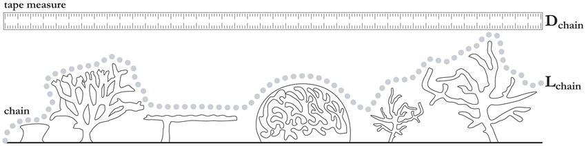

```{r setup, include=FALSE}
knitr::opts_chunk$set(echo = TRUE, warning = FALSE, message = FALSE)

library(ggplot2)
library(sf)
library(raster)
library(habtools)
library(rgl) # optional and might not work on some computers

```

# The *habtools* & biodiversity workshop

### Aims

- To develop an understanding of habitat complexity, including familiarity with geometric measures like rugosity and fractal dimension.
- To become familiar with how to capture benthic 3D meshes, digital evevation models (DEMs) and orthomosaics.
- To annotate ecological or environmental details for potential projects looking at the relationship between habitat complexity and biodiversity.

### Introduction

One of community ecology's few paradigms is that complex habitats tend to contain more species and at higher abundances than simple habitats. Currently, human and natural disturbances are changing the complexity of habitats faster than at any previous time in history. Understanding and predicting the effects of these changes on biodiversity and ecosystem function is now of paramount importance. Yet, we have only a crude, correlative understanding of how complexity changes affect biodiversity, predicting that if habitat becomes flatter, species' diversity and abundances decline. We have next to no idea of how complexity changes affect ecosystem functions and services. Generating accurate predictions requires integration of the geometric and ecological principles that mechanistically underpin complexity-ecological relationships. 

Habitat geometry can be measured in many ways. However, in marine systems, surface rugosity has become gold standard, because it can be measured quickly with a tape measure and a length of chain. The chain is draped as closely as possible over the the benthos and then the linear distance between the two ends of the chain is measured (Fig. 1). Rugosity is calculated as $R = \frac{D_{chain}}{L_{chain}}$. If the surface is completely flat, then $D_{chain}$ will be the same as $L_{chain}$. On more convoluted surfaces, the linear distance $D_{chain}$ is shorter, and rugosity is greater. 



Many studies have found relationships between surface rugosity and the richness and abundance of associated species. Many studies have found no relationship at all, calling into questions what rugosity actually tells us about a habitat and how niches are distributed and partitioned. Advances in the way marine scientists can capture benthic surfaces have transformed our capacity to explore the geometric-biodiversity relationships (Torres-Pulliza et al. 2020). One such advance is the generation of surface structure from motion, which allows us to associate orthomosics of benthic cover (essentially stitched together photographs over large areas) with the 3D surfaces upon which the biodiversity lives (Pizarro et al. 2017). 

### Objectives

1. Generate a digital elevation model (DEM) and an orthomosaic.
2. Calculate three geometric measures (rugosity, fractal dimension and height range) and explore the relationships among them.
3. Think about reef features that could be annotated or measured over your orthomosaic, especially those you believe to be related to habitat complexity. Examples include,  larval settlement, species richness, territorial grazer density, fish size structure, spatial clustering of primary producers, etc. 

### Gear list

- Camera, charged
- Three scale markers (6 targets)
- A compass (often found in phones)
- GPS (often found in phones)
- Depth gauge for depths at markers
- Transect tape for measuring between scale markers
- Slate for notes (e.g., GPS, depths)

### Fieldwork

- Find a natural surface you want to model.
- Place the three sets of targets in an L shape; ideally at the same vertical height. Measure distances between one target on each set.
- Image the surface as instructed. You want at least 100 images.
- Record GPS coordinates above one target.
- Pick everything up.

### Metashape

- Export photos from camera into a folder named `habtools-workshop/sfm/images/` on your computer.
- Open `MetashapePro`.
- From the `Workflow` menu, select `Add Photos` and select all the photos in the `habtools-workshop/sfm/images/` folder.

###### Align photos

- From the `Workflow` menu, select `Align Photos` and ensure the selections reflect the following screenshot, then click `OK`:


- Following alignment, which can take a while if you have lots of photographs, you can view what's called the sparse point cloud. 

###### Referencing & scaling

- Next you detect markers using `Tools` -> `Markers` -> `Detect Markers...`. Click `OK`. 
- Go to `Reference` panel.
- Open `Reference` settings (wrench and hammer symbol at the top-right of reference pane)
- Choose `Local Coordinates (m)` coordinate system (note that you can also create geo-referenced surfaces if you take a GPS coordinate for your surface).
- Highlight target pairs from scale bars (using crtl/cmd key), right-click `Create Scale Bar`.
- Enter scale distances in reference pane below the target pane (e.g., 0.08 m for 8 cm).
- Click the double-arrow symbol at top of reference pane. 

###### Build model

- From the `Workflow` menu, select `Build Model` and ensure the selections reflect the following screenshot, then click `OK`:


- Following building, which can take a while if you have lots of photographs, you can view the model. 
- From the `Workflow` menu, select `Build Point Cloud` and ensure the selections reflect the following screenshot, then click `OK`:


- Following building, you can view what's called the dense cloud. 
- Use the `Workflow` menu to build a DEM and a orthomosaic.
- Export the DEM and orthomosaic into a folder called `habtools-workshop/data`.

### RStudio

- Open RStudio.
- `File` > `New Project...`.
- Select `Version Control` and then `Git`.
- Copy `https://github.com/jmadinlab/habtools-workshop` and paste into the `Repository URL` field. Press tab and the `Project directory name` should auto-fill. 
- Select `Browse...` and choose where you want to store the project on your computer. Then click `OK`.
- Open `habtools-workshop.Rmd`

1. Load DEM

```{r}

dem <- raster("data/dem.tif")
plot(dem)

```

2. Surface complexity

```{r}

dem_square <- dem_crop(dem, x0=0.25, y0=0.25, L=0.5, plot=TRUE)
plot(dem_square)

# Surface area
surface_area(dem_square)
surface_area(dem_square) / 0.5^2

# Rugosity
rg(dem_square)
rg(dem_square, L0=0.001)
rg(dem_square, L0=0.01)

# Height range
hr(dem_square)

# Fractal dimension
fd(dem_square, method="sd", lvec=c(0.031, 0.063, 0.125, 0.25, 0.5), diagnose=TRUE, parallel=TRUE)

# dem split

dem_list <- dem_split(dem_square, 0.1)
length(dem_list)
plot(dem)
rect(0, 0, 0.5, 0.5)
plot(dem_list[[1]], add=TRUE)
plot(dem_list[[25]], add=TRUE)

rdhs <- lapply(dem_list, rdh, method_fd="sd", lvec=c(0.031, 0.063, 0.125, 0.25, 0.5), parallel=TRUE)
rdhs <- rdhs %>% 
  plyr::ldply()

ggplot(data=rdhs, aes(x=R, y=H, color=D, size=D)) +
  geom_point()

# plot3d(rdhs$R, rdhs$D, rdhs$H)

# Sample DEM

dem_sample(dem_square, L=0.1, plot=TRUE)

```

3. Re-project DEM (if you have a GPS coordinate)

```{r}

lat <- 43.020704
lon <- 144.836736

sr <- paste0("+proj=tmerc +lat_0=", lat, " +lon_0=", lon, " +k=1 +x_0=0 +y_0=0 +datum=WGS84 +units=m +no_defs")
crs(dem) <- sr

writeRaster(dem, filename="data/dem-crs.tif", overwrite=TRUE)

```

4. Load orthomosaic & re-project

```{r}

ort <- stack("data/ortho.tif")
plotRGB(ort)
points(0, 0, col="red", pch=3)
rect(0, 0, 0.5, 0.5)

crs(ort) <- sr
writeRaster(ort, filename="data/ortho-crs.tif", overwrite=TRUE)

```

4. Explore in GIS

Open ArcGIS or QGIS and load the re-projected DEM and orthomosaic.  You can print your orthomosaic on underwater paper and annotate plants and animals. You can add these annotations in GIS so you have a spatial map of your study taxa. In QGIS:

- `Layer` -> `Create Layer...` -> `New Shapefile Layer...`
- File name. Click little dotted box. Select `habtools-workshop/data` folder. Write `annotations`
- Geometry type. Select `Point` (you can also create polygons to outline areas)
- Add a new field called `species`
- Click `OK`
- Double-clock the `annotations` layer in the left-hand panel. Select `Labels`. At top choose `Single labels` and select species as the `Value`. Also, select `Draw text buffer` lower down in the menu.  Click `OK`.
- Click the pencil icon (Toggle Editing). 
- Click the `Add Point Feature` icon (three dots and a star-like thing)
- Click on the surface to annotate, and enter your species names. 
- Don't forget to save (little disk icon)

5. Open annotations

```{r}

ann <- read_sf("data/annotations.shp")
ann <- st_transform(ann, crs=sr) # applying the same coordinate system as the DEM

dem <- raster("data/dem-crs.tif")
plot(dem)
points(ann, col="red", pch=4)
text(ann, ann$species)

dem_list <- dem_crop(dem, x0=st_coordinates(ann)[,1], st_coordinates(ann)[,2], L=0.1, plot=TRUE)
points(ann, col="red", pch=4)
text(ann, ann$species)

rdhs <- lapply(dem_list, rdh, lvec=c(0.012, 0.025, 0.05, 0.1), parallel=TRUE)
rdhs <- rdhs %>% 
  plyr::ldply()

rdhs <- cbind(rdhs, species=ann$species)

ggplot(data=rdhs, aes(x=species, y=D, color=species)) +
  geom_boxplot() +
  geom_jitter(width=0.1)

```

##### References

- Pizarro, O., Friedman, A., Bryson, M., Williams, S. B. & Madin, J. A simple, fast, and repeatable survey method for underwater visual 3D benthic mapping and monitoring. Ecology and Evolution 7, 1770–1782 (2017). [[link](https://doi.org/10.1002/ece3.2701)]

- Schiettekatte N, Asbury M, Chen G, Dornelas M, Reichert J, Torres-Pulliza D, Zawada KJA, Madin JS (2025). “habtools: an R package to calculate 3D metrics for surfaces and objects.” Methods in Ecology and Evolution. [[link](https://doi.org/10.1111/2041-210X.70027)]

- Torres-Pulliza D, Dornelas M, Pizarro O, Bewley M, Blowes SA, Boutros N, Brambilla V, Chase TJ, Frank G, Friedman A, Hoogenboom MO, Williams S, Zawada KJA, Madin JS (2020) A geometric basis for surface habitat complexity and biodiversity. *Nature Ecology & Evolution* 4:1495-1501. [[link](https://doi.org/10.1038/s41559-020-1281-8)]

- Torres-Pulliza, D., Charendoff, J., Couch, C., Suka, R., Gray, A., Lichowski, F., ... & Oliver, T. (2024). Processing coral reef imagery using Structure-from-Motion photogrammetry: Standard operating procedures (2023 update). [[link](https://repository.library.noaa.gov/view/noaa/60890)]
