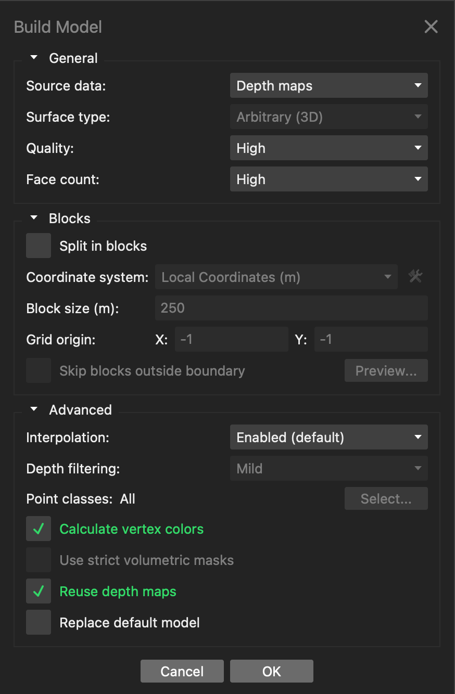
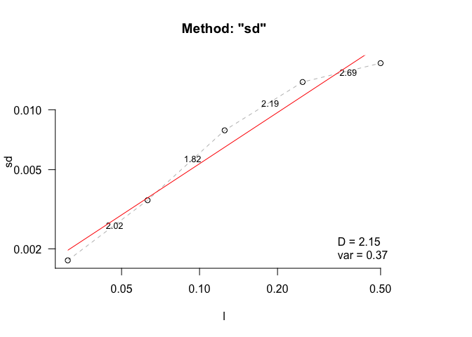
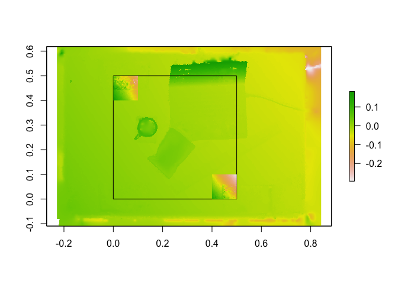

# Step 1: Capturing a 3D surface

### Project set-up

- Open RStudio.
- `File` \> `New Project...`.
- Select `Version Control` and then `Git`.
- Copy `https://github.com/jmadinlab/habtools-workshop` and paste into
  the `Repository URL` field. Press tab and the `Project directory name`
  should auto-fill.
- Select `Browse...` and choose where you want to store the project on
  your computer. Then click `OK`.
- In the bottom-right pane, click `Folder` to create a new folder and
  call is `sfm`.
- Click on the `sfm` folder in the file list, and create another folder
  called `images`. This is where you will store the images you take in
  the field.

### Gear list

- Camera, charged.
- Three scale markers (6 targets).
- A compass (often found in phones).
- GPS (often found in phones).
- Depth gauge for depths at markers.
- Transect tape for measuring between scale markers.
- Slate for notes (e.g., GPS, depths).

### Fieldwork

- Find a natural surface you want to model.
- Place the three sets of targets in an L shape; ideally at the same
  vertical height. Measure distances between one target on each set.
- Image the surface as instructed. You want at least 150 images.
- Record GPS coordinates above one target.
- Pick everything up.

### Metashape

- Export photos from camera into a folder named
  `habtools-workshop/sfm/images/` on your computer.
- Open `MetashapePro`.
- From the `Workflow` menu, select `Add Photos` and select all the
  photos in the `habtools-workshop/sfm/images/` folder.

###### Align photos

- From the `Workflow` menu, select `Align Photos` and ensure the
  selections reflect the following screenshot, then click `OK`:


- Following alignment, which can take a while if you have lots of
  photographs, you can view what’s called the sparse point cloud.

###### Referencing & scaling

- Next you detect markers using `Tools` -\> `Markers` -\>
  `Detect Markers...`. Click `OK`.
- Go to `Reference` panel.
- Open `Reference` settings (wrench and hammer symbol at the top-right
  of reference pane)
- Choose `Local Coordinates (m)` coordinate system (note that you can
  also create geo-referenced surfaces if you take a GPS coordinate for
  your surface).
- Highlight target pairs from scale bars (using crtl/cmd key),
  right-click `Create Scale Bar`.
- Enter scale distances in reference pane below the target pane (e.g.,
  0.08 m for 8 cm).
- Click the double-arrow symbol at top of reference pane.

###### Build model

- From the `Workflow` menu, select `Build Model` and ensure the
  selections reflect the following screenshot, then click `OK`:



- Following building, which can take a while if you have lots of
  photographs, you can view the model.
- From the `Workflow` menu, select `Build Point Cloud` and ensure the
  selections reflect the following screenshot, then click `OK`:


- Following building, you can view what’s called the dense cloud.
- Use the `Workflow` menu to build a DEM and a orthomosaic.
- Export the DEM and orthomosaic into a folder called
  `habtools-workshop/data`.

# Step 2: Estimating complexity metrics

- Go to RStudio and open `habtools-workshop.Rmd`.

- If RStudio is closed, go the the `habtools-workshop` folder on your
  computer and double-click the `habtools-workshop.Rproj` file.

- Load and plot the DEM

``` r
dem <- raster("data/dem.tif")
plot(dem)
```

<!-- -->

- Crop the DEM and calculate some metrics

``` r
dem_square <- dem_crop(dem, x0=0.25, y0=0.25, L=0.5, plot=TRUE)
```

<!-- -->

``` r
plot(dem_square)
```

<!-- -->

``` r
# Surface area
surface_area(dem_square)
```

    ## [1] 0.3777671

``` r
surface_area(dem_square) / 0.5^2
```

    ## [1] 1.511068

``` r
# Rugosity
rg(dem_square)
```

    ## [1] 1.509668

``` r
rg(dem_square, L0=0.001)
```

    ## [1] 1.433975

``` r
rg(dem_square, L0=0.01)
```

    ## [1] 1.143267

``` r
# Height range
hr(dem_square)
```

    ## [1] 0.1234203

``` r
# Fractal dimension
fd(dem_square, method="sd", lvec=c(0.031, 0.063, 0.125, 0.25, 0.5), diagnose=TRUE, parallel=TRUE)
```

<!-- -->

    ## $D
    ## [1] 2.145263
    ## 
    ## $data
    ##       l          sd
    ## 1 0.031 0.001750858
    ## 2 0.063 0.003510580
    ## 3 0.125 0.007879888
    ## 4 0.250 0.013781664
    ## 5 0.500 0.017142509
    ## 
    ## $lvec
    ## [1] 0.031 0.063 0.125 0.250 0.500
    ## 
    ## $D_vec
    ## [1] 2.018998 1.819969 2.193497 2.685172
    ## 
    ## $var
    ## [1] 0.3701006
    ## 
    ## $method
    ## [1] "sd"

``` r
# dem split

dem_list <- dem_split(dem_square, 0.1)
length(dem_list)
```

    ## [1] 25

``` r
plot(dem)
rect(0, 0, 0.5, 0.5)
plot(dem_list[[1]], add=TRUE, legend=FALSE)
plot(dem_list[[25]], add=TRUE, legend=FALSE)
```

<!-- -->

``` r
rdhs <- lapply(dem_list, rdh, method_fd="sd", lvec=c(0.031, 0.063, 0.125, 0.25, 0.5), parallel=TRUE)
rdhs <- rdhs %>% 
  plyr::ldply()

ggplot(data=rdhs, aes(x=R, y=H, color=D, size=D)) +
  geom_point()
```

<!-- -->

``` r
# plot3d(rdhs$R, rdhs$D, rdhs$H)

# Sample DEM

dem_sample(dem_square, L=0.1, plot=TRUE)
```

<!-- -->

    ## class      : RasterLayer 
    ## dimensions : 195, 195, 38025  (nrow, ncol, ncell)
    ## resolution : 0.000512008, 0.000512008  (x, y)
    ## extent     : 0.3686637, 0.4685053, 0.27677, 0.3766116  (xmin, xmax, ymin, ymax)
    ## crs        : NA 
    ## source     : memory
    ## names      : dem 
    ## values     : -0.02380816, -0.006555019  (min, max)

- Re-project DEM (if you have a GPS coordinate)

``` r
# Change to your lat, lon values
lat <- 43.020704
lon <- 144.836736

sr <- paste0("+proj=tmerc +lat_0=", lat, " +lon_0=", lon, " +k=1 +x_0=0 +y_0=0 +datum=WGS84 +units=m +no_defs")
crs(dem) <- sr

writeRaster(dem, filename="data/dem-crs.tif", overwrite=TRUE)
```

4.  Load orthomosaic & re-project

``` r
ort <- stack("data/ortho.tif")
plotRGB(ort)
points(0, 0, col="red", pch=3)
rect(0, 0, 0.5, 0.5)
```

<!-- -->

``` r
crs(ort) <- sr
writeRaster(ort, filename="data/ortho-crs.tif", overwrite=TRUE)
```

# Step 3: Exploring biodiversity relationships

Open ArcGIS or QGIS and load the re-projected DEM and orthomosaic. You
can print your orthomosaic on underwater paper and annotate plants and
animals. You can add these annotations in GIS so you have a spatial map
of your study taxa. In QGIS:

- `Layer` -\> `Create Layer...` -\> `New Shapefile Layer...`

- File name. Click little dotted box. Select `habtools-workshop/data`
  folder. Write `annotations`

- Geometry type. Select `Point` (you can also create polygons to outline
  areas)

- Add a new field called `species`

- Click `OK`

- Double-clock the `annotations` layer in the left-hand panel. Select
  `Labels`. At top choose `Single labels` and select species as the
  `Value`. Also, select `Draw text buffer` lower down in the menu. Click
  `OK`.

- Click the pencil icon (Toggle Editing).

- Click the `Add Point Feature` icon (three dots and a star-like thing)

- Click on the surface to annotate, and enter your species names.

- Don’t forget to save (little disk icon)

- Open annotations

``` r
ann <- read_sf("data/annotations.shp")
ann <- st_transform(ann, crs=sr) # applying the same coordinate system as the DEM

dem <- raster("data/dem-crs.tif")
plot(dem)
points(ann, col="red", pch=4)
text(ann, ann$species)
```

<!-- -->

- Crop surface around annotations.

``` r
dem_list <- dem_crop(dem, x0=st_coordinates(ann)[,1], st_coordinates(ann)[,2], L=0.1, plot=TRUE)
points(ann, col="red", pch=4)
text(ann, ann$species)
```

<!-- -->

- Calculate complexity metrics in vicinity of annotations.

``` r
rdhs <- lapply(dem_list, rdh, lvec=c(0.012, 0.025, 0.05, 0.1), parallel=TRUE)
rdhs <- rdhs %>% 
  plyr::ldply()

rdhs <- cbind(rdhs, species=ann$species)

ggplot(data=rdhs, aes(x=R, y=H, color=species, size=D)) +
  geom_point()
```

<!-- -->

``` r
ggplot(data=rdhs, aes(x=species, y=R)) +
  scale_y_log10() +
  geom_boxplot() +
  geom_jitter(width=0.1)
```

<!-- -->
